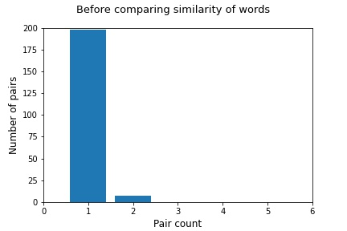
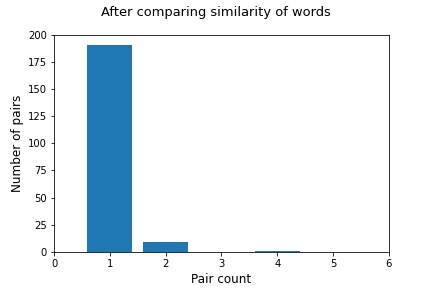
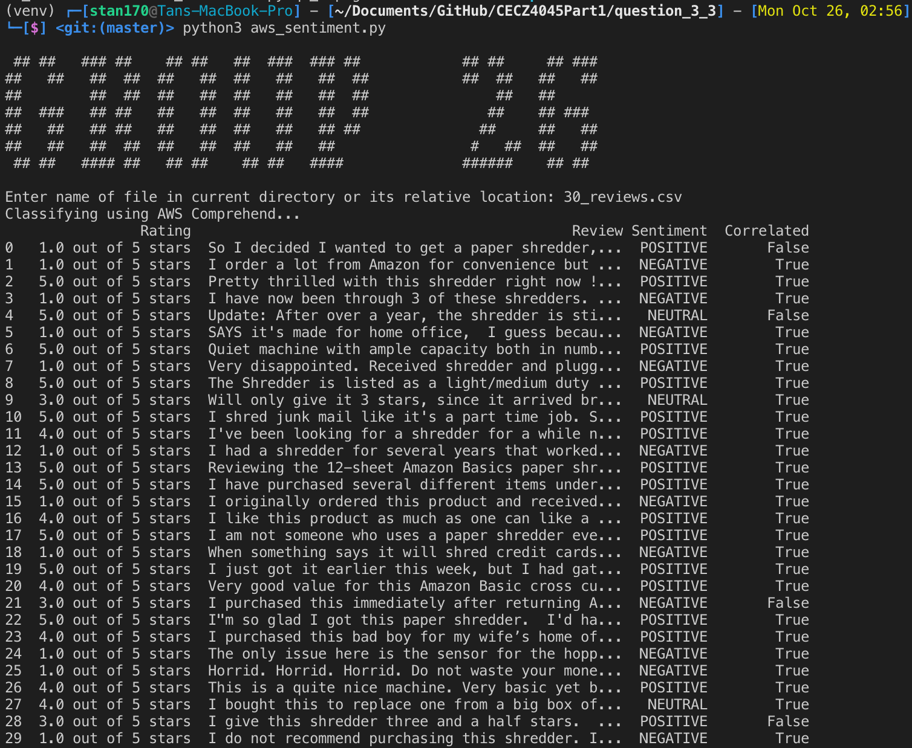

## Readme.txt 

____

#### A *link* to download the third-party library if you used any in your assignment.

> pip install -r requirements.txt

___

#### A guide on how to setup your system, and how to use your system (*e.g.,* command lines, input format, parameters).

General

> Git clone this repository / download source code. Navigate to the root directory of the folder. 

3.1 Domain Specific Dataset Analysis (20 marks)

- Sentence Segmentation (found in sentence_segm folder)
  1. run `jupyter notebook` in the terminal/cmd
  2. navigate to sentence_segm/SentenceSegm.ipynb 
- Tokenizer (found in tokenizer folder)
  1. run `python3 tokenizer.py` in the terminal/cmd
  2. select which dataset to perform token and stemming and choose a filename to output the results
- POS Tagger (found in POS Tagger folder)
  1. copy the POS_Tagger.py into the required dataset folder.
  2. run `python3 POS_Tagger.py` in the terminal/cmd

3.2 Development of a ⟨ Noun - Adjective ⟩ Pair Ranker (20 marks)

- Scrapping reviews required 

  1. getting the reviews100.csv inside downloads folder 
  2. run `cd amazon_reviews_scraping && scrapy crawl amazon -o ../downloads/reviews100.csv -t csv` in the terminal/cmd
- Program
  1. run `jupyter notebook` in the terminal/cmd
  2. navigate to question_3_2/q3_2.ipynb

3.3 Application (10 marks)

- Sentiment Analysis (found in question_3_3 folder)
  1. run `python3 aws_sentiment.py` in the terminal/cmd
  2. enter `30_reviews.csv` as the csv file for parsing
- REST API (found in question_3_3/sentiment-api folder)
  - AWS Comprehend - analysis
  - AWS Lambda, Serverless - hosting 

___

#### Explanations of sample output obtained from your system.

3.1 Domain Specific Dataset Analysis (20 marks)

> Placeholder

3.2 Development of a ⟨ Noun - Adjective ⟩ Pair Ranker (20 marks)

> 

> 

3.3 Application (10 marks)

> 

___

###### Members

1. Muddineni Krishnavyas 
2. Tan Zhi Yang 
3. Tan Sheng Rong (Leader)
4. Toh Ting Yu Darren 
5. Wang Guan Zhi, Leonard